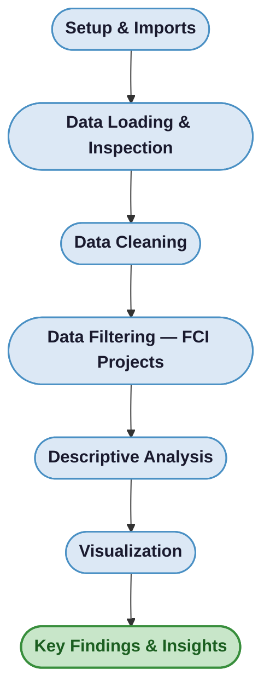
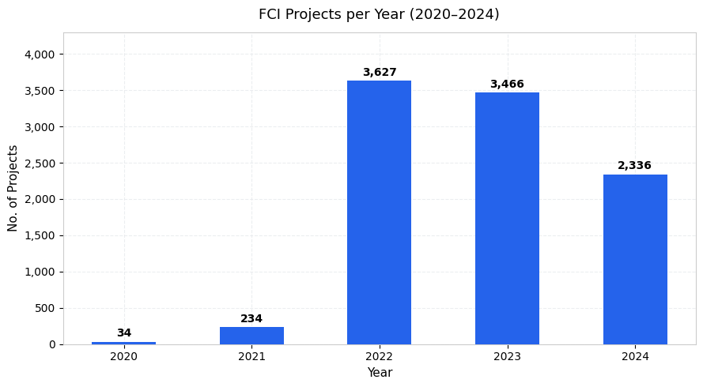
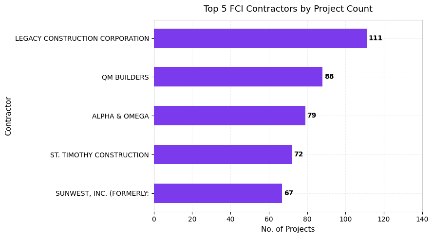
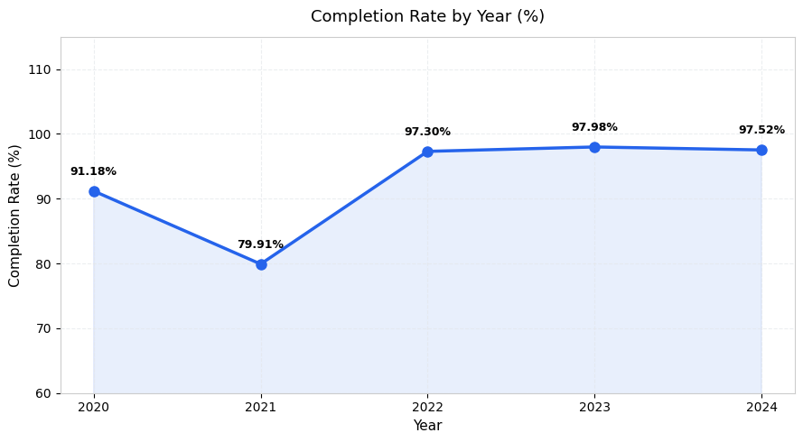
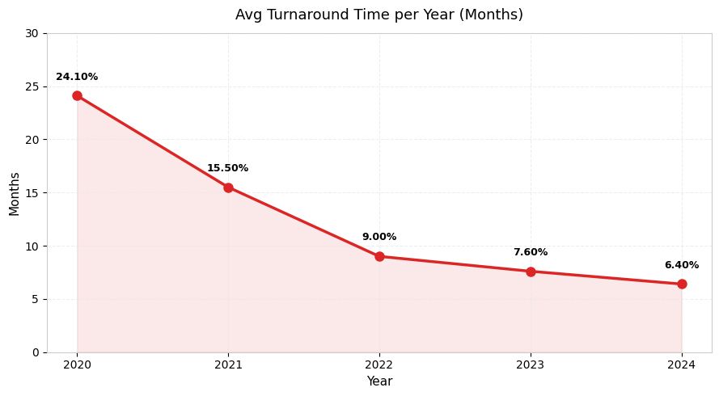
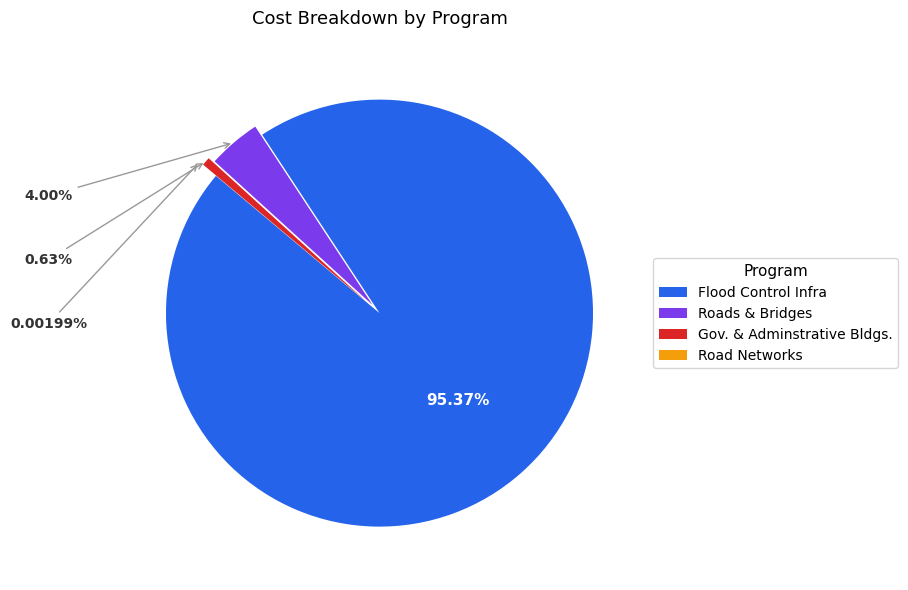
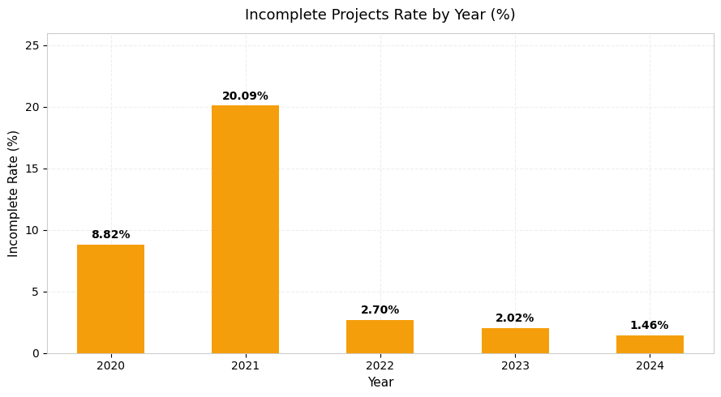

<div align="center">

# Evaluating DPWH Flood Control Infrastructure Projects in the Philippines

### A Data-Driven Performance Analysis, 2020–2024

<p>
  
  
  
  
  
</p>

<p>
  A descriptive analytics study on DPWH Flood Control Infrastructure (FCI) projects<br/>
  examining <strong>project volume</strong>, <strong>contractor performance</strong>, <strong>completion rates</strong>,<br/>
  <strong>turnaround time</strong>, <strong>cost distribution</strong>, and <strong>over-budget risk indicators</strong>.
</p>

<p>
  <a href="#overview">Overview</a> &nbsp;|&nbsp;
  <a href="#workflow">Workflow</a> &nbsp;|&nbsp;
  <a href="#dataset">Dataset</a> &nbsp;|&nbsp;
  <a href="#analysis--results">Analysis</a> &nbsp;|&nbsp;
  <a href="#key-findings">Findings</a> &nbsp;|&nbsp;
  <a href="#discussion">Discussion</a>
</p>

<table>
  <tr>
    <td><strong>Author</strong></td>
    <td>Kyla Mae N. Valoria</td>
    <td>
      <a href="https://drive.google.com/file/d/15IbQXlLBWrh8KoOBel6f98bLrgds_sxk/view?usp=sharing">
        
      </a>
    </td>
  </tr>
  <tr>
    <td><strong>Data Source</strong></td>
    <td colspan="2">Power BI Pilipinas Community Data Challenge 2025 — DPWH Project Dataset</td>
  </tr>
  <tr>
    <td><strong>Analysis Period</strong></td>
    <td colspan="2">2020 – 2024</td>
  </tr>
</table>

</div>

<br/>

## Overview

This study focuses on the **Department of Public Works and Highways (DPWH)** Flood Control Infrastructure (FCI) program — the largest segment of government infrastructure spending in the Philippines. Using Python-based descriptive analytics and visualization, it evaluates project and contractor performance with emphasis on identifying trends in over-budget risk.

| Dimension | Focus |
|:---:|---|
| **Project Volume** | Annual count of FCI projects, 2020–2024 |
| **Contractor Concentration** | Top 5 firms by project count and total value |
| **Completion Rate** | Percentage of projects completed per year |
| **Turnaround Time** | Average months from planned start to effective end |
| **Cost Distribution** | Share of total DPWH budget by program |
| **Over-Budget Risk** | Incomplete project rate as a proxy indicator |

> [!NOTE]
> Direct monetary over-budget analysis was not feasible — the `UtilizedAmount` field is entirely unpopulated for FCI records. **Incomplete project status is used as a proxy** for stalled, underfunded, or problematic projects.

<br/>

## Repository Structure

<details>
<summary><strong>Click to expand file tree</strong></summary>

```bash
.
├── images/
│   ├── chart1_projects_per_year.png
│   ├── chart2_top_contractors.png
│   ├── chart3_completion_rate.png
│   ├── chart4_turnaround.png
│   ├── chart5_cost_by_program.png
│   └── chart6_incomplete_by_year.png
└── DPWH_FCI_Data_Analysis.ipynb
```

</details>

<br/>

## Tools and Libraries

<p>
  
  
  
</p>

All libraries come pre-installed in Google Colab — no additional setup required.

<br/>

## Workflow



<br/>

## Dataset

> [!TIP]
> The raw dataset contains **12,871 government projects** across all DPWH programs. After filtering to Flood Control Infrastructure only, **11,757 FCI records** were retained for analysis.

### Raw Dataset Overview

| Field | Detail |
|:---|:---|
| Source file | `Govt-Projects-v1-Transformed-v1.1.xlsx` |
| Total rows | `12,871` |
| Total columns | `39` |
| Program focus | Flood Control Infrastructure |
| Analysis period | `2020 – 2024` |

### Key Fields

<kbd>ProjectID</kbd> &nbsp; <kbd>ProjectStatus</kbd> &nbsp; <kbd>ContractorName</kbd> &nbsp; <kbd>ProjectCost</kbd> &nbsp; <kbd>UtilizedAmount</kbd> &nbsp; <kbd>PlannedStartDate</kbd> &nbsp; <kbd>PlannedContractCompletionDate</kbd> &nbsp; <kbd>ProgramName</kbd>

### Missing Value Summary

| Field | Null Count | % Missing |
|:---|:---:|:---:|
| `ProjectStatus` | 0 | 0.00% |
| `ContractorName` | 1 | 0.01% |
| `ProjectCost` | 0 | 0.00% |
| `UtilizedAmount` | 136 | 1.06% |
| `PlannedStartDate` | 2,034 | 15.80% |
| `PlannedContractCompletionDate` | 2,004 | 15.57% |
| `ActualContractCompletionDate` | 12,866 | **99.96%** |

### Data Cleaning Steps

- Standardized column names — stripped whitespace, replaced spaces with underscores
- Parsed date fields to `datetime` format; `ActualContractCompletionDate` parsed from verbose string format
- Removed duplicate records by `ProjectID`
- Filled missing values — `ContractorName → 'Unknown'`; `UtilizedAmount → 0`
- Derived new fields — <kbd>PlannedYear</kbd>, <kbd>TurnaroundDays</kbd>, <kbd>EffectiveEndDate</kbd>
- Merged Zip Code lookup for enriched location data

<br/>

## Analysis & Results

Six charts were produced using Matplotlib, covering the five core stakeholder questions.

### Chart 1 — FCI Projects per Year

<p align="center">
  
</p>

| Year | Project Count |
|:---:|:---:|
| 2020 | 34 |
| 2021 | 234 |
| 2022 | **3,627** |
| 2023 | 3,466 |
| 2024 | 2,336 |

> Project volume surged approximately **100×** from 2020 to 2022, reflecting a major policy-driven budget push. Activity remained elevated through 2023–2024.

---

### Chart 2 — Top 5 Contractors by Project Count

<p align="center">
  
</p>

| Rank | Contractor | Projects | Total Cost (₱B) |
|:---:|---|:---:|:---:|
| 1 | Legacy Construction Corporation | 111 | 8.03 |
| 2 | QM Builders | 88 | 7.05 |
| 3 | Alpha & Omega Gen. Contractor | 79 | 5.37 |
| 4 | St. Timothy Construction Corporation | 72 | 4.60 |
| 5 | Sunwest, Inc. | 67 | **8.25** |

> [!TIP]
> **Sunwest, Inc.** ranks 5th by project count but **leads by total contract value (₱8.25B)**, averaging ~₱2M more per project than Legacy — indicating specialization in larger-scope work.

---

### Chart 3 — Completion Rate per Year

<p align="center">
  
</p>

| Year | Completion Rate |
|:---:|:---:|
| 2020 | 91.18% |
| 2021 | **79.91%** |
| 2022 | 97.30% |
| 2023 | 97.98% |
| 2024 | 97.52% |

> The 2021 dip coincided with the rapid expansion phase and likely COVID-related delays. Performance recovered strongly to **97%+** from 2022 onward.

---

### Chart 4 — Average Turnaround Time per Year

<p align="center">
  
</p>

| Year | Avg. Days | Avg. Months |
|:---:|:---:|:---:|
| 2020 | 732 | 24.10 |
| 2021 | 472 | 15.50 |
| 2022 | 274 | 9.00 |
| 2023 | 231 | 7.60 |
| 2024 | 194 | **6.40** |

> Average turnaround fell from **24.1 months to 6.4 months** over five years — reflecting improved efficiency, smaller project scopes, or tighter scheduling.

---

### Chart 5 — Cost Breakdown by Program

<p align="center">
  
</p>

| Program | Total Cost (₱B) | Share |
|---|:---:|:---:|
| **Flood Control Infra** | **705.16** | **95.37%** |
| Roads & Bridges | 29.55 | 4.00% |
| Gov. & Administrative Bldgs. | 4.67 | 0.63% |
| Road Networks | 0.01 | 0.00% |

> [!IMPORTANT]
> FCI dominates total DPWH project cost at **95.37% (₱705.16B)** — making its performance critical to overall public spending efficiency. Even small inefficiencies in this sector carry significant budget implications.

---

### Chart 6 — Incomplete Projects Rate by Year

<p align="center">
  
</p>

| Year | Total Projects | Incomplete | Incomplete Rate |
|:---:|:---:|:---:|:---:|
| 2020 | 34 | 3 | 8.82% |
| 2021 | 234 | 47 | **20.09%** |
| 2022 | 3,627 | 98 | 2.70% |
| 2023 | 3,466 | 70 | 2.02% |
| 2024 | 2,336 | 34 | **1.46%** |

**Top 5 contractors with most incomplete projects:**

| Contractor | Incomplete Projects |
|---|:---:|
| Quirante Construction Corporation | 9 |
| Goldrich Construction & Trading | 7 |
| CM Tan Construction | 5 |
| Orani Construction and Supply Corporation | 5 |

<br/>

## Key Findings

> [!NOTE]
> The following summarizes the core outcomes across all six analyses.

- FCI project volume surged ~100× from 2020 to 2022, driven by a major policy-level budget push
- Completion performance improved sharply after 2021 — reaching **97%+** from 2022 to 2024
- Turnaround time was cut by **73%** over five years, from 24.1 months (2020) to 6.4 months (2024)
- **Legacy Construction Corp.** leads by project count (111); **Sunwest, Inc.** leads by total value (₱8.25B)
- Flood Control Infra accounts for **95.37%** of total DPWH project cost — making performance monitoring in this program especially critical
- Incomplete project rate peaked at **20.09% in 2021** and fell to **1.46% by 2024**, indicating dramatically improved execution
- <kbd>UtilizedAmount</kbd> is entirely unpopulated for FCI records, preventing direct monetary over-budget analysis

<br/>

## Discussion

> The year **2021 stands out as the weakest** across all dimensions — lowest completion rate, highest incomplete project rate, and longest turnaround times. This suggests operational or management challenges during the rapid scale-up phase. In contrast, **2022–2024 show consistent improvement**, reflecting better planning, execution, or monitoring practices.

Project delivery is concentrated among a small number of contractors, meaning their performance strongly influences aggregate outcomes. This highlights the need for **closer contractor-level monitoring**, especially for firms handling large volumes or high-value projects.

> [!IMPORTANT]
> To enable proper over-budget tracking in future studies, **DPWH should prioritize populating `UtilizedAmount`** in data submissions. Access to actual expenditure data would allow direct identification of cost overruns rather than relying on completion status as a proxy.

<br/>

## Future Improvements

<details>
<summary><strong>Click to expand</strong></summary>

- [ ] Obtain complete cost utilization or actual expenditure data to enable direct identification of over-budget projects
- [ ] Implement contractor-level monitoring frameworks, particularly for firms handling large volumes or high-value projects
- [ ] Strengthen performance evaluation methodologies beyond incomplete project rate as a risk proxy
- [ ] Investigate operational and management factors that contributed to the 2021 performance dip

</details>

<br/>

---

<div align="center">
  <sub>
    Built with Python, pandas, and Matplotlib &nbsp;&bull;&nbsp; Dataset from Power BI Pilipinas Community Data Challenge 2025<br/>
    <a href="https://drive.google.com/file/d/15IbQXlLBWrh8KoOBel6f98bLrgds_sxk/view?usp=sharing">Read the Technical Paper</a>
  </sub>
</div>
